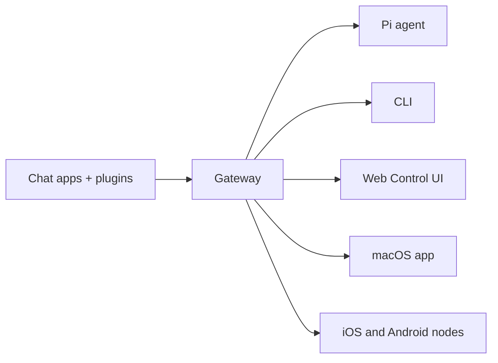

---
read_when:
  - 向新用户介绍 OpenClaw
summary: OpenClaw 是一个多渠道 AI 智能体 Gateway 网关，可在任何操作系统上运行。
title: OpenClaw
x-i18n:
  generated_at: "2026-02-04T17:53:40Z"
  model: claude-opus-4-5
  provider: pi
  source_hash: fc8babf7885ef91d526795051376d928599c4cf8aff75400138a0d7d9fa3b75f
  source_path: index.md
  workflow: 15
---

# OpenClaw 🦞

<p align="center">
    
    
</p>

> _"去壳！去壳！"_ — 大概是一只太空龙虾说的

<p align="center">
  <strong>适用于任何操作系统的 AI 智能体 Gateway 网关，支持 WhatsApp、Telegram、Discord、iMessage 等。</strong><br />
  发送消息，随时随地获取智能体响应。通过插件可添加 Mattermost 等更多渠道。
</p>

<Columns>
  <Card title="入门指南" href="/start/getting-started" icon="rocket">
    安装 OpenClaw 并在几分钟内启动 Gateway 网关。
  </Card>
  <Card title="运行向导" href="/start/wizard" icon="sparkles">
    通过 `openclaw onboard` 和配对流程进行引导式设置。
  </Card>
  <Card title="打开控制界面" href="/web/control-ui" icon="layout-dashboard">
    启动浏览器仪表板，管理聊天、配置和会话。
  </Card>
</Columns>

OpenClaw 通过单个 Gateway 网关进程将聊天应用连接到 Pi 等编程智能体。它为 OpenClaw 助手提供支持，并支持本地或远程部署。

## 工作原理



Gateway 网关是会话、路由和渠道连接的唯一事实来源。

## 核心功能

<Columns>
  <Card title="多渠道 Gateway 网关" icon="network">
    通过单个 Gateway 网关进程连接 WhatsApp、Telegram、Discord 和 iMessage。
  </Card>
  <Card title="插件渠道" icon="plug">
    通过扩展包添加 Mattermost 等更多渠道。
  </Card>
  <Card title="多智能体路由" icon="route">
    按智能体、工作区或发送者隔离会话。
  </Card>
  <Card title="媒体支持" icon="image">
    发送和接收图片、音频和文档。
  </Card>
  <Card title="Web 控制界面" icon="monitor">
    浏览器仪表板，用于聊天、配置、会话和节点管理。
  </Card>
  <Card title="移动节点" icon="smartphone">
    配对 iOS 和 Android 节点，支持 Canvas。
  </Card>
</Columns>

## 快速开始

<Steps>
  <Step title="安装 OpenClaw">
    ```bash
    npm install -g openclaw@latest
    ```
  </Step>
  <Step title="新手引导并安装服务">
    ```bash
    openclaw onboard --install-daemon
    ```
  </Step>
  <Step title="配对 WhatsApp 并启动 Gateway 网关">
    ```bash
    openclaw channels login
    openclaw gateway --port 18789
    ```
  </Step>
</Steps>

需要完整的安装和开发环境设置？请参阅[快速开始](/start/quickstart)。

## 仪表板

Gateway 网关启动后，打开浏览器控制界面。

- 本地默认地址：http://127.0.0.1:18789/
- 远程访问：[Web 界面](/web)和 [Tailscale](/gateway/tailscale)

<p align="center">
  
</p>

## 配置（可选）

配置文件位于 `~/.openclaw/openclaw.json`。

- 如果你**不做任何修改**，OpenClaw 将使用内置的 Pi 二进制文件以 RPC 模式运行，并按发送者创建独立会话。
- 如果你想要限制访问，可以从 `channels.whatsapp.allowFrom` 和（针对群组的）提及规则开始配置。

示例：

```json5
{
  channels: {
    whatsapp: {
      allowFrom: ["+15555550123"],
      groups: { "*": { requireMention: true } },
    },
  },
  messages: { groupChat: { mentionPatterns: ["@openclaw"] } },
}
```

## 从这里开始

<Columns>
  <Card title="文档中心" href="/start/hubs" icon="book-open">
    所有文档和指南，按用例分类。
  </Card>
  <Card title="配置" href="/gateway/configuration" icon="settings">
    核心 Gateway 网关设置、令牌和提供商配置。
  </Card>
  <Card title="远程访问" href="/gateway/remote" icon="globe">
    SSH 和 tailnet 访问模式。
  </Card>
  <Card title="渠道" href="/channels/telegram" icon="message-square">
    WhatsApp、Telegram、Discord 等渠道的具体设置。
  </Card>
  <Card title="节点" href="/nodes" icon="smartphone">
    iOS 和 Android 节点的配对与 Canvas 功能。
  </Card>
  <Card title="帮助" href="/help" icon="life-buoy">
    常见修复方法和故障排除入口。
  </Card>
</Columns>

## 了解更多

<Columns>
  <Card title="完整功能列表" href="/concepts/features" icon="list">
    全部渠道、路由和媒体功能。
  </Card>
  <Card title="多智能体路由" href="/concepts/multi-agent" icon="route">
    工作区隔离和按智能体的会话管理。
  </Card>
  <Card title="安全" href="/gateway/security" icon="shield">
    令牌、白名单和安全控制。
  </Card>
  <Card title="故障排除" href="/gateway/troubleshooting" icon="wrench">
    Gateway 网关诊断和常见错误。
  </Card>
  <Card title="关于与致谢" href="/reference/credits" icon="info">
    项目起源、贡献者和许可证。
  </Card>
</Columns>
